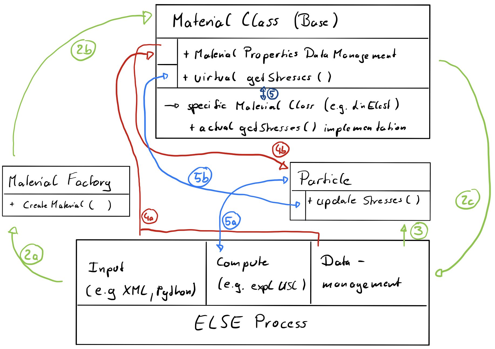

# ELSE MPM Material System:
In MPM, a constitutive equation is evaluated at the particles. These constitutive equations follow the standard principle of mapping strain measures into stresses, depending on material parameters and by considering a meterial history.

These constitutive behaviour is implemented in subroutines in the ELSE code. In the following the implementation is described, regarding an explicit USL scheme. This implies two assumption:
* The explicit solution procedure only requires the Cauchy stress tensor.
* The argument of a stress evaluation is the deformation gradient.

Within this setup a material instance has two major tasks. On the one hand a Data-Management for material parameters is placed here, following the assumption that these data only needs to be available once and are constant over the domain, covered by the material. The second task is to provide the implementation of the stress function to return the Cauchy stress tensor, for various materials.

The following setup illustrates the algorithmic handling of these tasks with the concerning classes.

## ELSE MPM Material Treatment:



1. Any input within the ELSE system makes a request to create a Material object with a specified `MaterialKind` and `MaterialName`.
Hereby the `MaterialKind` directly refers to the kind of constitutive behaviour requested, which is specific to its implementation (MPM Material Class) [Example: `MaterialKind="LinearElasticity_A"`]. The `MaterialName` however is any generic name to differentiate materials at runtime [Example: `MaterialName="MyWonderSteel"`].

2. The code sends it request to the function `CreateMaterial()` which is implemented as the main part of the so called MaterialFactory in ELSE. In this MaterialFactory, which is effectively one header file, a material object is created and its pointer is returned. The key aspect of the MaterialFactory is that it knows all actually implemented MPM Materials and choses the right implementation based on the `MaterialKind`.

3. The returned pointer to the new material instance is stored within the ELSE data management. If requested, the pointer to the material is also used within other instances, e.g. particles.

4. Via the pointer, ELSE functions like from the input phase might add material parameters to the Material via its Material parameter data management. Likewise a value of these might be requested e.g a particle asks its material for its density.

5. If anywhere in ELSE code (e.g. by particles within the solution procedure) a request for stresses is made, the material is requested to compute them. Although the actual stress computation might be very divers, it is all parsed by the MPM Material Base Classes interface. The stress request is redirected by the base part of the class to the actual implementation. All the non material specific data is provided by the caller via the function arguments (e.g. deformation measure, history ...).
The actual implementation of the constitutive behaviour may use the domain constant material parameter however, via the material parameter data management of the base class, respectively.
Once the stress response is computed it is parsed though the same interface back to the caller (e.g. particle).

## The Material Factory:

The material factory is basically a single header file. This implements the `CreateMaterial` function which is called if a new material may be constructed. The idea is that a simulation is discretized with bodies, which are associated to a material. That means that a body has constant material properties (material history and IO is still particle dependent) and one function to compute the stresses. We recall this as a body has one material model.

This means what the user want to implement is a specific material model. The way to do this is to implement a child class of the Material Base Class. This way a common interface is guarantied. The process also involves, including the header to the new Material into the MaterialFactory, as well as modifying the `CreateMaterial` function. This way, at a global request for creating the new material model, the factory exactly does so while returning a pointer the the object at runtime.

#### Files:
* materials/ELSE_MPMMaterialFactory.hpp

#### Namespace: ELSE::MPM::

#### Attributes: [-]

#### Functions:

Creating a Material Object with a certain model, identified by strings:
```c++
Material* CreateMaterial(const std::string MaterialKind, const std::string MaterialName)
```
* `MaterialKind` -> Identifier of the material model, e.g. "LinearElasticity_A".
* `MaterialName` -> Identifier of the material object (arbitrary name), e.g. "MyWonderSteel".
*  A standard material creation:
```c++
std::string MyMaterialName;
ELSE::MPM::Material* Mate;
Mate = ELSE::MPM::CreateMaterial("LinearElasticity_A","Aluminium");
Mate -> getName(MyMaterialName);
std::cout << "Name of the Material: " << MyMaterialName << std::endl;
```
Here we assumed that the material model "LinearElasticity_A" is implemented (it is in fact by default). The factory will succeed the creation of the material object and it is functionally available after that.

*  A FAIL material creation:
```c++
std::string MyMaterialName;
ELSE::MPM::Material* Mate;
Mate = ELSE::MPM::CreateMaterial("UNKNOWN","Aluminium");
Mate -> getName(MyMaterialName);
std::cout << "Name of the Material: " << MyMaterialName << std::endl;
```
Here we assumed that a material model with name "UNKNOWN" is not implemented. The following request of the objects name will not cause an error at compile time. However, the `CreateMaterial` function will return a `nullptr` and this execution of the `getName` member function call at runtime will cause a Segmentation Fault. Nevertheless prior to this the prompt will show `Error: No Implementation for a Material: UNKNOWN found.` which helps identifying this error.


## The Material Base Class:

## Implementation of new MPM Materials:
