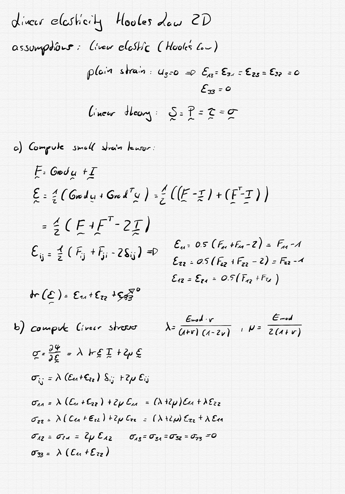

# Materials for MPM2D

Materials are defined by objects before the simulation. The idea is to write wrappers, or the actual implementation within the class definition for a specific material ID. The material object then provides routing to the correct "stress function" when e.g. the stresses are needed.

## Materials Implemented:
* ID = 1 Default Material
* ID = 2 Linear Elastic Plane Strain Ace
* ID = 3 Linear Elastic Plane Stress Ace

## Default Material:
| Input | type | values (or example value)|Explanation|
|-------|------|--------------------------| |
|ID     |int   |1                         | |
|MaterialParameter|double[2]|{21e3,0.3}| Young's modulus (Emod), Possion's ratio (nu)|
|Input|double[9]|{1,0,0,0,1,0,0,0,1}| Deformation gradient F = {F11,F12,F13,F21,F22,F23,F31,F32,F33}|
|Output|double[9]|{0,0,0,0,0,0,0,0,1}| Cauchy stresses Sig = {Sig11,Sig12,Sig13,Sig21,Sig22,Sig23,Sig31,Sig32,Sig33}|

